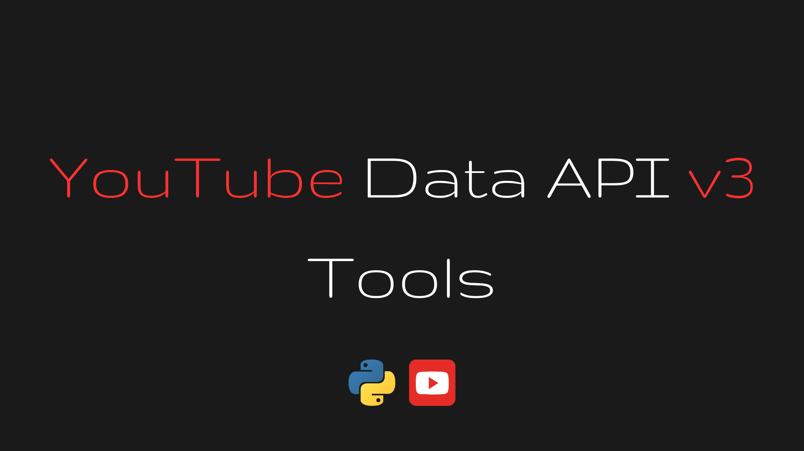

# YouTube Data API v3 Tools Library



> The YouTube Data API v3 Tools Library is a concise wrapper around the YouTube API. The `YouTubeDataAPIv3Tools` 
> class and sub-classes contain hundreds of methods to interact with YouTube. These methods cover all 
> categories such as videos, video categories, playlists, playlist items, subscriptions, comments, 
> comment threads, captions, live streaming, channels, thumbnails, watermarks, localizations, activities, 
> search, members, membership levels & abuse reporting. I made sure to cover all the bases.

## [Setup](#setup)
        
### [OAuth 2.0 credentials](#oauth2credentials)

A `client_secret.json` file is needed in order for this class to be functional.
Or should I say ... classy ....

### [Required Python modules](#required_modules)

- google-auth
- google-auth-oauthlib
- google-auth-httplib2
- google-api-python-client
      
Keep in mind that you need to have the proper **OAuth 2.0** authentication set up and the 
permissions to manage a YouTube account. Below is a step-by-step guide on how to
obtain a ***client_secret.json*** file. 

*Please also note that the steps for setting up OAuth 2.0 authentication and using the 
client_secret.json file might change over time. For the latest and most detailed 
instructions, you should refer to the official Google API documentation for the YouTube 
API and OAuth 2.0 authentication for Python.* [https://developers.google.com/youtube/v3/quickstart/python](https://developers.google.com/youtube/v3/quickstart/python)

1) [Google Cloud Console:](#google-cloud-console)

To use the ***YouTube API*** or any other Google API, you need to create a project on the 
**Google Cloud Console** and enable the APIs you want to use.

2) [OAuth 2.0 Credentials:](#oauth-2-credentials)
        
After creating the project and enabling the YouTube API, you need to create OAuth 2.0 
credentials. These credentials are used to identify your application and to 
authenticate and authorize access to the API. The credentials contain a client ID, 
client secret, and other information.
                
3) [Download Client Secret:](#download-client-secret)

Once you create OAuth 2.0 credentials, you can download the *client_secret.json* file 
from the Google Cloud Console. This file contains the client ID and client secret, 
which are used in the authentication process.
            
4) [Authentication Flow:](#authentication-flow)
        
When you run your Python application that interacts with the YouTube API, it will 
prompt the user to authenticate their Google account through a web browser (if necessary). 
The *client_secret.json* file is used during this authentication flow to identify your 
application and establish a secure connection.

5) [Access Tokens:](#access-tokens)

After the user grants permission to your application, the authentication server provides 
your application with an access token. This access token is used in API requests to 
prove that your application has been granted permission to access the user's resources.

6) [Protecting Client Secret:](#protecting-client-secret) 
            
The *client_secret.json* file contains sensitive information (client secret), so it should 
be kept confidential and not shared or exposed publicly. It is important to store the 
client_secret.json file securely on the server-side of your application.

When you use the Google API Client Library for Python to interact with the YouTube API, you'll 
need to set up the OAuth 2.0 authentication flow and provide the path to the client_secret.json 
file in your code to initiate the authentication process.

---

## [Usage](#usage)
> !!! NOTE: Any sensitive data used in these examples is void or not real !!!


First import the `youtube_api_tools` module.

```python
import youtube_api_tools
```

Next create a `YouTubeDataAPIv3Tools` object and pass the path to your ***client_secret.json*** file path
as the first argument to the constructor and a list of scopes that you want to use as the 
2nd argument. Then optionally pass an API developer key as the 3rd argument if you have one.

```python
_client_secret = "client_secret_913312345634-hsdfrlsskr1gqsedjdsddnjga57j84s0chml.apps.googleusercontent.com.json"
_scopes = ["https://www.googleapis.com/auth/youtube.readonly"]
_dev_key = "A01ssSpaAWMeM1XsfguYJFxxnDIamdfgh-tLSAs823d"

youtube = youtube_api_tools.YouTubeDataAPIv3Tools(
    _client_secret,
    _scopes,
    _dev_key
)
```

The constructor will call the `get_authenticated_service()` method which will set up the OAuth 2.0 
flow using your ***client_secret.json*** file to authenticate the user and will store the 
authorization token in a ***token.pickle*** file. The actual service is wrapped in a method called `_get_authenticated_service()` and dependency injected. Pretty much all of the YouTubeDataAPIv3Tools class 
methods and subclass methods rely on this authentication, so the service returned from `_get_authenticated_service` 
will be stored in a class variable called `self.service`. Upon instanciation of any subclass of `YouTubeDataAPIv3Tools` a reference to the YouTubeDataAPIv3Tools class will be passes. This we way have a reference to the service stored in `self.service` in all sub classes and methods. Here is an example:

```python
tube = YouTubeDataAPIv3Tools(<your json>, <scopes>, <dev key>)

# pass 'tube' as the first argument to the subclasses upon
# instanciaution.
channel = tube.Channel(tube) 
playlist = tube.Playlist(tube)
item = tube.PlaylistItem(tube)
video = tube.Video(tube)

cnn_channel_id = channel.get_id(False, "CNN")
cnn_playlist_id = playlist.get_id("US News", cnn_channel_id)
usnews_playlist_videos = playlist.get_playlist_items(cnn_playlist_id)

# Like and unlike a playlists videos based on filters.
for playlist_video in cnn_playlist_videos:
    video_id = playlist_video["id"]
    video_title = playlist_video["snippet"]["title"]
    if video_title == "somethin somethin":
        video.like(video_id)
    else:
        video.unlike(video_id)
    
```

If no calls to the API are made after a few minutes the user will have to reauthenticate and
grant the app permissions again in the browser. The ***token.pickle*** file will no
longer work until this is done.

> Note: The `token.pickle` file is important because without it the reauthentication process has to 
be done with every individual call to the YouTube Data API.

Once you have created the `YouTubeDataAPIv3Tools` object. The following subclasses are available:

- YouTubeDataAPIv3Tools.Channel
- YouTubeDataAPIv3Tools.ChannelSection
- YouTubeDataAPIv3Tools.Playlist
- YouTubeDataAPIv3Tools.PlaylistItem
- YouTubeDataAPIv3Tools.Video
- YouTubeDataAPIv3Tools.VideoCategories
- YouTubeDataAPIv3Tools.Captions
- YouTubeDataAPIv3Tools.Subscriptions
- YouTubeDataAPIv3Tools.Members
- YouTubeDataAPIv3Tools.MembershipLevel
- YouTubeDataAPIv3Tools.Comment
- YouTubeDataAPIv3Tools.CommentThread
- YouTubeDataAPIv3Tools.Thumbnail
- YouTubeDataAPIv3Tools.WaterMark
- YouTubeDataAPIv3Tools.Activity
- YouTubeDataAPIv3Tools.Search
- YouTubeDataAPIv3Tools.LiveBroadcasts
- YouTubeDataAPIv3Tools.Localization
- YouTubeDataAPIv3Tools.AbuseReport
- YouTubeDataAPIv3Tools.AbuseReport.VideoAbuseReportReason

These classes wrap each resource type and contain a ton of methods to interact 
with them in various ways.

---

### Get your channel ID:

```python
tube = youtube_api_tools.YouTubeDataAPIv3Tools(arg1, arg2, ...)
channel = tube.Channel(tube) 
```

### Get a playlist ID:

```python
playlist_id = youtube.get_playlist_id()
```

### Get a video ID:


The rest of the documentation will be finished soon.

## [Resources](#resources)

For information on common API errors check out [API_ERRORS.md](./docs/API_ERRORS.md) or 
the official documentation here: [https://developers.google.com/youtube/v3/docs/errors](https://developers.google.com/youtube/v3/docs/errors)

For information on the resources that these class methods act on check
out [API_RESOURCES.md](./docs/API_RESOURCES.md)
